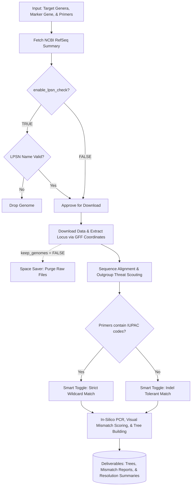

# MarkerCompass

**MarkerCompass:** An R framework for benchmarking marker genes and primer sets for taxonomic resolution.

`MarkerCompass` is a comprehensive, end-to-end R pipeline designed to evaluate the taxonomic and clade-level resolution of *in-silico* PCR primer sets. The tool automatically downloads target genomes from NCBI based on a list of genera, filters and dereplicates strains, parses `.gff` coordinates to isolate specific loci, runs an *in-silico* PCR extraction with an adaptive IUPAC-aware string matcher, and outputs publication-ready phylogenetic resolution metrics, trees, and high-fidelity primer mismatch reports.

---

## 🧠 The Rationale: Why MarkerCompass?

Targeted amplicon sequencing using marker genes (e.g., 16S rRNA, *rpoB*, *groL*) remains the gold standard for microbial taxonomic classification. However, high-throughput next-generation sequencing (NGS) platforms typically rely on short-read amplicons spanning only a fraction of the full-length gene (Bukin et al., 2019). 

Relying on "universal" short-read amplicons presents two major challenges in microbiome and evolutionary research:

1. **Variable Taxonomic Resolution:** The phylogenetic signal of a specific amplicon is highly lineage-dependent. A marker gene or sub-region that provides perfect species-level resolution for one taxonomic group may completely fail to differentiate closely related species in another (Johnson et al., 2019).
2. **Primer Bias & Clade Dropout:** "Universal" primers frequently contain sequence mismatches against specific clades. This leads to severe amplification bias, underrepresentation, or the complete dropout of key taxa in metabarcoding datasets (Klindworth et al., 2013; Parada et al., 2016).

`MarkerCompass` solves these challenges by taking a targeted, data-driven approach. Before beginning costly library preparations or sequencing runs, researchers can use this framework to objectively determine which marker gene and primer set will yield the highest taxonomic resolution for their specific clades of interest, while quantifying and avoiding critical primer mismatches. 

Alternatively, for already-sequenced metabarcoding datasets, researchers can feed their genus-level taxonomy back into `MarkerCompass` to definitively validate which taxa can be confidently classified down to the species level based on the utilized primer set, and which cannot.

---

## 📥 Installation

You can install the development version of `MarkerCompass` directly from GitHub using the `remotes` package. All required CRAN and Bioconductor dependencies will be installed automatically.

```R
# Install the remotes package if not already present
if (!requireNamespace("remotes", quietly = TRUE)) {
  install.packages("remotes")
}

# Install MarkerCompass
remotes::install_github("dybrettin/MarkerCompass", quiet = TRUE)
```

*(Note: For optimal alignment speed with large datasets (large genera, many genera, or increasing taxonomic level during analysis), ensure MAFFT is installed on your system and accessible via your system PATH. The package will automatically fall back to the native `DECIPHER` alignment engine if MAFFT is unavailable).*

---

## 🚀 Quick Start & Usage Guide

Once installed, running the pipeline requires only a single function call: `run_marker_pipeline()`.

Here is the complete suite of options available to configure your pipeline run. This example targets the 16S rRNA gene for the *Pantoea* genus using generic file paths:

```R
library(MarkerCompass)

run_marker_pipeline(
  target_genera = c("Pantoea"),                  # Required. A character vector of target genera or path to a .csv list
  output_dir = "path/to/output_directory",       # Required. Path to the folder where results should be saved
  db_dir = "path/to/database_directory",         # Required. Path to the directory where Refseq master and LPSN databases are cached. Refseq database will automatically download to this directory if not found or older then refseq_max_age parameter setting
  mafft_path = NULL,                             # Path to local MAFFT executable (NULL defaults to DECIPHER alignment). Good for analysis with many sequences
  target_gene = "16S",                           # Required. The specific gene text to search for in the .gff file
  feature_type = "rRNA",                         # Required. The feature category to filter by (e.g., "rRNA", "CDS")
  custom_primers = NULL,                         # Path to a .csv containing custom primers (NULL uses built-in 16S set)
  only_reference = TRUE,                         # Recommendation = TRUE. Restricts the pipeline to only use RefSeq Reference or Representative genomes
  dereplicate_strains = TRUE,                    # Keeps only the highest-quality genome per strain label to prevent clonal bias and removes identical copies of genes, 16S for example is multi copy
  remove_unclassified = TRUE,                    # Automatically drops strains with ambiguous names (e.g., "sp.", "uncultured")
  enable_lpsn_check = TRUE,                      # Recommended = TRUE. Validates species names against the LPSN database to flag synonyms which usually ruins monophyletic calculations.
  lpsn_db_path = "path/to/lpsn_gss.csv",         # Path to your local LPSN database CSV file. See "Under the Hood" section for download link to database
  max_contigs = 100,                             # Maximum allowed contigs for draft genomes (RefSeq references bypass this)
  max_tax_level = "Genus",                       # Highest taxonomic tier to assess for clade resolution. Default is Genus
  n_threats = 50,                                # Number of closest outgroup genera to pull full species data for alignment
  max_scout_genera = Inf,                        # Maximum outgroup genera to fetch during the phylogenetic scout phase
  refseq_max_age = 50,                          # Maximum age (in days) of local RefSeq summary before forcing a fresh download
  keep_genomes = FALSE                           # If FALSE, acts as a space saver by deleting .fna and .gff files after extraction but not the Genome Cache generated when going up to higher taxonomic levels, delete manually if you want to remove those files.
)
```

---

## 🗺️ Pipeline Workflow



---

## ⚙️ Core Mechanics & Features

* **Universal Marker Gene Targeting:** By adjusting the target gene and feature type parameters, you can extract and assess primers for any annotated gene in the NCBI database, not just 16S rRNA.
* **"Smart Toggle" for Degenerate Primers:** Handling environmental primers with multiple `N`, `R`, `Y`, or `M` bases can be difficult due to how sequence mismatching handles insertions/deletions. The pipeline features a Smart Toggle that scans your input primers. If a primer consists entirely of standard bases (A, C, G, T), the script uses indel tolerance. If it detects *any* IUPAC ambiguity codes, it seamlessly switches to strict wildcard matching, preventing false-negative extraction failures on highly degenerate primers.
* **Pre-Flight LPSN Gatekeeping:** Many genomes on NCBI feature outdated, synonymous, or invalidly published species names. The pipeline cross-references the LPSN (List of Prokaryotic names with Standing in Nomenclature) database *before* downloading genomes. Invalid species lose their reference status and are subjected to strict fragmentation checks or dropped entirely, saving bandwidth and preventing taxonomic confusion.
* **High-Fidelity Mismatch Reporting:** The mismatch report generates a visual string alignment (e.g., `AT~~~~..~AA~..~.T~.A~TT~GG`) to help troubleshoot primer failures. Exact amplicon coordinate extraction prevents the aligner from clipping the edges of sequences, and true wildcard scoring ensures that degenerate bases that successfully match their target (e.g., an `N` matching an `A`) are visually scored with a tilde (`~`) rather than a hard mismatch.

---

## 🛠️ Configuration & Adjustable Parameters

The `run_marker_pipeline()` function accepts a variety of parameters to fine-tune your analysis. They are grouped below by their functional role.

### Input, Output & Infrastructure
* **`target_genera`**: A character vector of target genera (e.g., `c("Gilliamella", "Snodgrassella")`) or a string path to a `.csv` file containing a list of genera to process sequentially.
* **`custom_primers`**: Path to a `.csv` file containing custom primer pairs. If left as `NULL`, the script defaults to a built-in list of common 16S rRNA primer sets.
* **`output_dir`**: Path to the folder where results should be saved. Each targeted genus generates a dedicated subfolder here. *(Default: `"."`)*
* **`db_dir`**: Path to the directory where master databases (NCBI summary, LPSN) are stored. Setting this to a static folder prevents the pipeline from re-downloading massive databases for every new run. *(Default: `"."`)*
* **`lpsn_db_path`**: Path to your local LPSN database CSV file. *(Default: `"lpsn_gss.csv"`)*
* **`mafft_path`**: Path to your local MAFFT executable. If MAFFT is not found, the pipeline automatically falls back to the native R DECIPHER package. *(Default: `"mafft"`)*

### Gene Targeting
* **`target_gene`**: The specific gene text to search for in the `.gff` file. *(Default: `"16S"`)*
* **`feature_type`**: The feature category to filter by (e.g., `"rRNA"`, `"CDS"`, `"gene"`). This is critical because a term like "16S" might appear in multiple feature types, but you generally only want the `"rRNA"` one. Set to `"ANY"` to bypass. *(Default: `"rRNA"`)*

### Quality Control & Taxonomy
* **`enable_lpsn_check`**: **(Highly Recommended)** Validates species names against the LPSN database to flag synonyms and invalidly published names. *(Default: `TRUE`)*
* **`only_reference`**: Restricts the pipeline to only use RefSeq Reference or Representative genomes, filtering out lower-quality submissions. *(Default: `TRUE`)*
* **`dereplicate_strains`**: Keeps only the highest-quality genome per strain label to prevent clonal overrepresentation in your alignments and trees. *(Default: `TRUE`)*
* **`remove_unclassified`**: Automatically drops strains with ambiguous names like "sp.", "uncultured", or "Candidatus". *(Default: `TRUE`)*
* **`max_contigs`**: The maximum allowed number of contigs for draft genomes. True RefSeq Reference genomes bypass this limit. *(Default: `100`)*
* **`max_tax_level`**: The highest taxonomic tier to assess for clade resolution (e.g., `"Genus"`, `"Family"`, `"Order"`). *Warning: Higher levels require exponentially more compute time and bandwidth.* *(Default: `"Genus"`)*

### Execution & Resource Management
* **`n_threats`**: The number of closest outgroup genera to pull full species data for and align against your target. *(Default: `2`)*
* **`max_scout_genera`**: The maximum number of outgroup genera to fetch during the phylogenetic scout phase. Set to `Inf` for unlimited. *(Default: `50`)*
* **`refseq_max_age`**: Maximum age (in days) of your local RefSeq summary file before the script forces a fresh download from NCBI. Set to `Inf` to never redownload, or `0` to force a fresh download every time. *(Default: `30`)*
* **`keep_genomes`**: If `FALSE`, operates as a "Space Saver" and immediately deletes the `.fna` and `.gff` files from your hard drive after extracting the amplicons. *(Default: `TRUE`)*

---

## 🧬 Custom Primer CSV Format

If supplying your own primers via the `custom_primers` parameter, your `.csv` file must have the following exact headers:

| Primer_Name | Fwd_Seq | Rev_Seq | Min_Length | Max_Length |
| :--- | :--- | :--- | :--- | :--- |
| rpoB_Universal | CARTTYATGGAYCANNNNNAAYCC | CNGCYTGDCKYTKCATRTTNNNNNCCCAT | 300 | 700 |
| groL_H279 | GATNNNGCAGGNGATGGAACMACNAC | TGRTTNTCNCCAAAACCAGGNGCATT | 450 | 650 |

> **Length Bounds Note:** The pipeline uses `Min_Length` and `Max_Length` filters to discard off-target or truncated fragments. Ensure your maximum limits are sized generously enough to contain unexpected natural biological insertions.

---

## 📊 Pipeline Outputs

When a multi-genus pipeline run completes, `MarkerCompass` generates a centralized structure containing both run-wide master reports and genus-specific folders.

### 🏆 Primary Outputs

#### 1. Master Resolution Summary
*   **`Master_Resolution_Summary.csv`**: A high-level, cross-genus overview compiling which primer sets achieved 100% species-level resolution. This maps all targeted genera processed in a single run into one clean table for quick comparison.


#### 2. Comprehensive Phylogenies & Alignments
*   **`Alignment_*.fasta` & `Tree_*.pdf`**: Multi-sequence alignments (built using MAFFT or DECIPHER) and their corresponding Neighbor-Joining phylogenetic trees, generated for both the full-length baseline gene and every successfully simulated amplicon.


#### 3. High-Fidelity Primer Mismatch Map
*   **`primer_mismatch_report_summary.csv`**: A granular, sequence-level visual map of primer alignments. It flags exact nucleotide mismatches (`A`, `T`, `C`, `G`), valid IUPAC degeneracy matches (`~`), and perfect sequence matches (`.`), enabling rapid troubleshooting of target sequence variations.


#### 4. Taxonomic Resolution Comparison
*   **`Strict_Resolution_Comparison_RefOnly.pdf`**: A publication-ready bar chart comparing the taxonomic resolution power of each simulated amplicon region against the full-length baseline gene. Because some genomes in public databases are poorly sequenced or assembled, this report explicitly details which strains failed *in-silico* PCR, which primer caused the failure (Forward vs. Reverse), and flags strains that lacked an extractable or useable marker gene altogether.


#### 5. Sequence Entropy Mapping
*   **`Entropy_Map_RefOnly/All.pdf`**: A visual map tracing position-by-position sequence entropy across the entire baseline marker gene, with specific primer-binding zones and amplicon coordinates overlaid to visually highlight conservation and hypervariability.


---

### 📂 Secondary Logs & Asset Repositories

#### Audit & Quality Control Reports
*   **`extraction_status_report.csv`**: A verification log cataloging the exact number of targeted marker loci successfully isolated from each individual strain.
*   **`QC_Contig_Report.csv`**: An infrastructure quality control log detailing total contig counts per strain assembly, paired with an explicit `Yes/No` designation indicating if the assembly met your strict structural limits.
*   **`LPSN_Invalid_Species_Report.csv`**: A report tracking all genomes that were dropped or flagged because their taxonomic names were identified as outdated, synonymous, or invalidly published by the LPSN database.
*   **`genome_metadata_refseq_enriched.csv`**: A detailed metadata ledger of all processed genomes, enriched with their full taxonomy, assembly statistics, and RefSeq validation categories.
*   **`[Taxonomic_Level]_[Target]_Cophenetic_Threats.csv`** *(e.g., `Family_Pantoea_Cophenetic_Threats.csv`)*: A log identifying the closest outgroup clades (threats) calculated during the phylogenetic scout phase to thoroughly test primer specificity against related taxa.

*(Note: The `primer_mismatch_report_summary.csv` is compiled from individual logs and can be found under the Primary Outputs section).*

#### Local Data Repositories
*(Note: These asset folders are only retained if operating with `keep_genomes = TRUE`)*
*   **`annotations/`**: Centralized storage subdirectory containing the raw `.gff` features fetched from NCBI for every parsed strain.
*   **`genomes/`**: Centralized storage subdirectory containing the full `.fasta` genomic sequence files fetched during the execution run.

---

## ⚙️ Under the Hood: Databases & Tooling

To provide precise taxonomic resolution metrics and accurate phylogenetic tree placement, the framework connects several standard molecular databases with core computational libraries.

### Integrated Databases
* **NCBI RefSeq & Taxonomy:** Assembly sequences (`.fna`) and features (`.gff`) are systematically pulled from the official NCBI FTP directory. Full taxonomic path lineages are dynamically constructed by querying the NCBI Taxonomy database.
* **LPSN Database:** Cross-referencing names against the official **List of Prokaryotic names with Standing in Nomenclature** filters out taxonomic noise. 
  * *Database download resource:* [https://lpsn.dsmz.de/downloads](https://lpsn.dsmz.de/downloads)

### Computational Pipeline Engines
* **In-Silico PCR (`Biostrings`):** PCR testing and sequence extraction loops utilize optimized `matchLRPatterns` calls to process ambiguities and indels cleanly, generating rapid, sequence-specific extractions.
* **Multiple Sequence Alignment (`MAFFT` & `DECIPHER`):** To generate high-quality alignments rapidly, the script attempts an automated terminal hook into an accessible **MAFFT** path. If a local system binary is unconfigured or absent, alignment execution cleanly defaults to the native R-based `DECIPHER::AlignSeqs()` package.
* **Phylogenetic Inferences (`ape` & `ggtree`):** Distance matrices are computed inside `DECIPHER` via a terminal index pass and subsequently processed into standard Neighbor-Joining trees (`njs`) by the `ape` package. Final tree topologies and clade data maps are rendered for export using `ggtree`.

---

## 📚 Software,Tool & Rational References

`MarkerCompass` relies on several foundational open-source tools. If this pipeline assists in your research, please ensure the underlying framework authors are credited:

* **Biostrings (In-Silico PCR):** Pagès H, Aboyoun P, Gentleman R, DebRoy S (2024). *Biostrings: Efficient manipulation of biological strings.* R package.
* **DECIPHER (Sequence Alignment & Distance):** Wright ES (2016). *Using DECIPHER v2.0 to Analyze Big Biological Sequence Data in R.* The R Journal, 8(1), 352-359.
* **MAFFT (Command-Line Alignment):** Katoh K, Standley DM (2013). *MAFFT Multiple Sequence Alignment Software Version 7: Improvements in performance and usability.* Molecular Biology and Evolution, 30(4), 772-780.
* **ape (Phylogenetic Reconstruction):** Paradis E, Schliep K (2019). *ape 5.0: an environment for modern phylogenetics and evolutionary analyses in R.* Bioinformatics, 35(3), 526-528.
* **ggtree (Phylogenetic Visualization):** Yu G, Smith DK, Zhu H, Guan Y, Lam TT (2017). *ggtree: an R package for visualization and annotation of phylogenetic trees with their covariates and other associated data.* Methods in Ecology and Evolution, 8(1), 28-36.
* **rentrez (NCBI API Interaction):** Winter DJ (2017). *rentrez: an R package for the NCBI eUtils API.* The R Journal, 9(2), 520-526.

* **Bukin et al., 2019:** Bukin, Y. S., Galachyants, Y. P., Morozov, I. V., Grafodatskaya, A. D., Mikhailov, K. V., Alekseev, A. Y., ... & Likhoshway, Y. V. (2019). The effect of choice of 16S rRNA gene hypervariable regions on the results of next-generation sequencing-based analysis of biodiversity in environmental bacterial communities. *Scientific reports*, 9(1), 10734.
* **Johnson et al., 2019:** Johnson, J. S., Spakowicz, D. J., Hong, B. Y., Petersen, L. M., Demkowicz, P., Chen, L., ... & Weinstock, G. M. (2019). Evaluation of 16S rRNA gene sequencing for species and strain-level microbiome analysis. *Nature communications*, 10(1), 5029.
* **Klindworth et al., 2013:** Klindworth, A., Pruesse, E., Schweer, T., Peplies, J., Quast, C., Horn, M., & Glöckner, F. O. (2013). Evaluation of general 16S ribosomal RNA gene PCR primers for classical and next-generation sequencing-based diversity studies. *Nucleic acids research*, 41(1), e1-e1.
* **Parada et al., 2016:** Parada, A. E., Needham, D. M., & Fuhrman, J. A. (2016). Every base matters: assessing small subunit rRNA primers for marine microbiomes with mock communities, time series and global field samples. *Environmental microbiology*, 18(5), 1403-1414.

---

## 📚 Built-In Primer References

The script defaults to a curated list of commonly utilized, peer-reviewed 16S rRNA universal primer sets. If these default sets are utilized in your analysis, please refer to the original literature below:

* **V1-V2 (Lane 1991):** Lane, D. J. (1991). 16S/23S rRNA sequencing. In *Nucleic acid techniques in bacterial systematics* (pp. 115-175).
* **V1-V3 (Muyzer 1993):** Muyzer, G., de Waal, E. C., & Uitterlinden, A. G. (1993). Profiling of complex microbial populations by denaturing gradient gel electrophoresis analysis of polymerase chain reaction-amplified genes coding for 16S rRNA. *Applied and environmental microbiology*, 59(3), 695-700.
* **V3-V4 (Klindworth 2013):** Klindworth, A., Pruesse, E., Schweer, T., Peplies, J., Quast, C., Horn, M., & Glöckner, F. O. (2013). Evaluation of general 16S ribosomal RNA gene PCR primers for classical and next-generation sequencing-based diversity studies. *Nucleic acids research*, 41(1), e1-e1.
* **V3-V4 (Takahashi 2014):** Takahashi, S., Tomita, J., Nishioka, K., Hisada, T., & Nishijima, M. (2014). A novel closed-tube method for calculating bacterial population size and analyzing 16S rRNA gene amplicons. *PLoS One*, 9(5), e97323.
* **V3-V6 (Huber 2007):** Huber, J. A., Mark Welch, D. B., Morrison, H. G., Huse, S. M., Neal, P. R., Butterfield, D. A., & Sogin, M. L. (2007). Microbial population structures in the deep marine biosphere. *Science*, 318(5847), 97-100.
* **V4 EMP (Parada & Apprill 2016):** Parada, A. E., Needham, D. M., & Fuhrman, J. A. (2016). Every base matters: assessing small subunit rRNA primers for marine microbiomes with mock communities, time series and global field samples. *Environmental microbiology*, 18(5), 1403-1414. *(Note: Modified from original Apprill et al. 2015 constructs).*
* **V4-V5 & V5-V7 (Engelbrektson 2010):** Engelbrektson, A., Kunin, V., Wrighton, K. C., Zvenigorodsky, N., Chen, F., Ochman, H., & Hugenholtz, P. (2010). Experimental factors affecting PCR-based estimates of microbial species richness and evenness. *The ISME journal*, 4(5), 642-647.
* **Full-Length 16S (Callahan 2019):** Callahan, B. J., Wong, J., Heiner, C., Oh, S., Theriot, C. M., Gulati, A. S., ... & Bhatt, A. S. (2019). High-throughput amplicon sequencing of the full-length 16S rRNA gene with single-nucleotide resolution. *Nucleic acids research*, 47(18), e103-e103.
